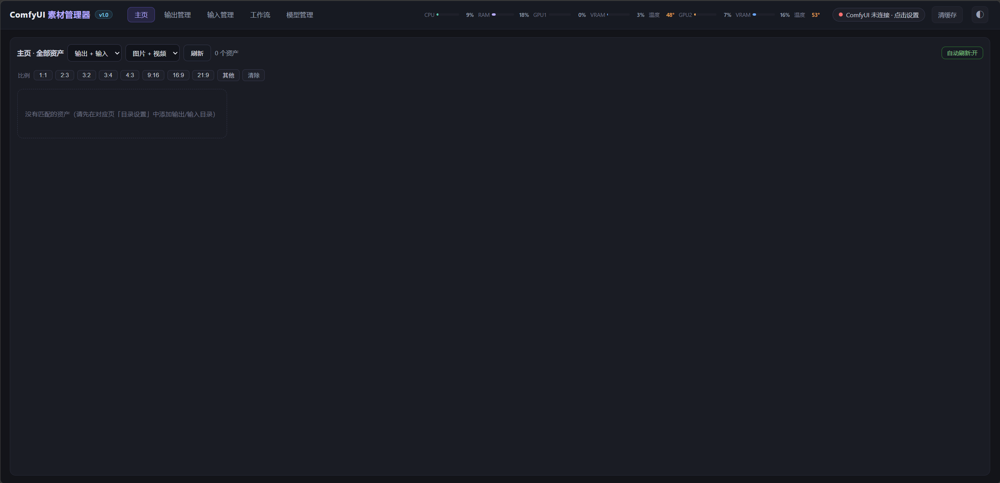
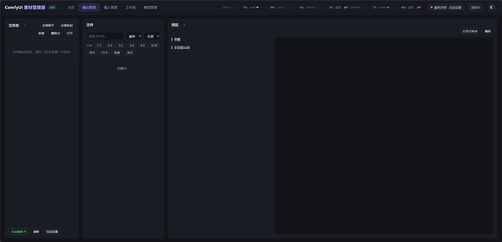
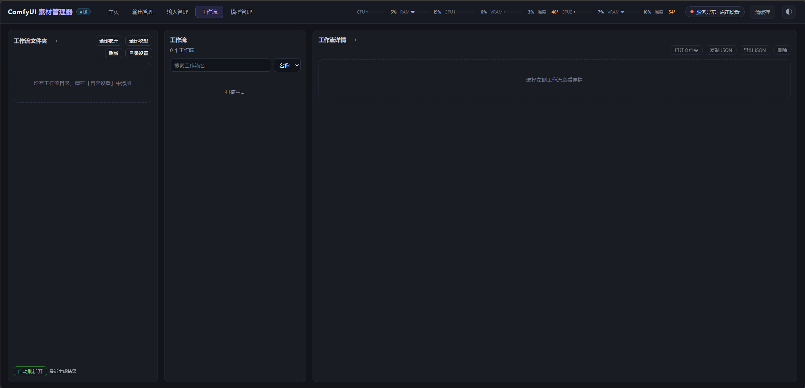
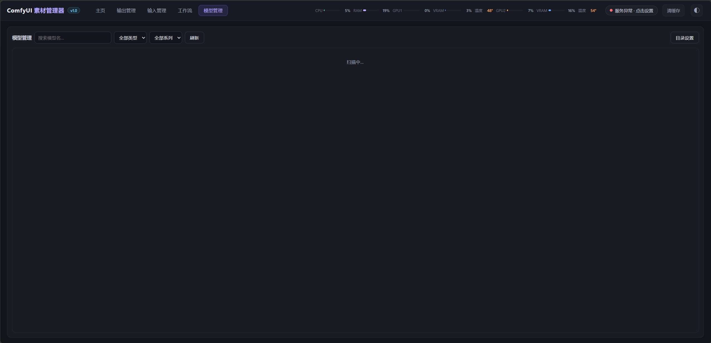

# ComfyUI 素材管理器

本地图形化的 ComfyUI 素材管理工具：集中浏览 **输出 / 输入 / 工作流 / 模型** 四类资产，提供 PNG 内嵌参数解析、正反提示词查看、比例筛选、实时自动刷新、工作流缺失节点检测、模型双层分类等能力。

> 版本 v1.0 · 后端 Flask + 前端单页应用

## 图片预览









## 功能速览

| 模块 | 核心能力 |
| --- | --- |
| **主页** | 聚合输出 + 输入所有资产，**瀑布式总览（JS 最短列平衡，按真实高度放入最矮列、底部对齐、消除空隙；网格直接加载原图高清显示，不使用缩略图）**；按钮控制显示输出/输入/图片/视频，**比例筛选**（1:1 / 2:3 / 3:2 / 3:4 / 4:3 / 9:16 / 16:9 / 21:9 / 其他）；**点击卡片在主页内弹出详情窗口**（参数 + 正反提示词 + 大图预览，支持打开文件夹/删除），不跳转页面；窗口缩放自动重排列数；自动刷新 |
| **输出管理** | 文件夹树分类浏览图片/视频；三分式查看 PNG 内嵌参数与正反提示词；**文件区与主页一致的 JS 最短列瀑布流（网格用原图高清显示）**；比例筛选（1:1 / 2:3 / 3:2 / 3:4 / 4:3 / 9:16 / 16:9 / 21:9 / 其他）；实时自动刷新；双击放大预览；删除 / 新建 / 打开文件夹 |
| **输入管理** | 与输出管理同构，管理 `input_dirs` 目录下的图片 / 视频资产（同样为最短列瀑布流、原图高清显示）；**独立「排除子目录」**（`input_excludes`，不扫描不显示，与输出排除互不影响） |
| **工作流管理** | 工作流解析（节点数 / 模型 / LoRA / 采样参数 / 提示词）；**采样参数全体系提取 + 多采样器**（覆盖 KSampler / KSamplerAdvanced / SamplerCustom / SamplerCustomAdvanced 关联体系 / KSampler(Efficient) / TiledKSampler / UltimateSDUpscale 等，从采样器 / 调度 / 步数 / CFG / 种子 / 降噪各字段提取；**双采样器工作流会标记「共 N 个采样器」并逐列列出**）；缺失节点检测（区分自定义节点与 ComfyUI 内置节点）；笔记节点读取编辑；最近生成结果关联（图片按节点指纹匹配该工作流；视频无内嵌元数据无法指纹，则**仅视频工作流**（工作流含视频生成/输出类节点，如 CreateVideo / MiniMax 图像转视频 / SaveVideo 等）才追加输出目录最近的视频并按修改时间排列，图片工作流不混入视频——点视频自动用当前工作流提取参数，无需手动选工作流）；复制 / 导出 JSON；**调用模型通用识别**（标准加载器 + 自定义 / 插件加载器，如 ControlNet 补丁 / 检测 / 放大 / GGUF 等，按扩展名从工作流提取，不受 `model_dirs` 限制）；**提示词来源选择器**（「当前工作流 / 历史生成」分栏：默认显示工作流提示词，点右侧历史输出自动切到历史生成、可手动切回）；**附加提示词全收**（除标准 `CLIPTextEncode` 的正/反向外，启发式收集所有自定义 / 模型衍生节点里的提示词文本——字符串多行节点、`QwenImageEditPlus` 文本编码、`MiniMax` 系列、音乐文本编码等——在提示词区**带来源节点标签**分组显示，如「附加提示词 · PrimitiveStringMultiline」；并智能过滤文件名 / 路径 / 采样算法 / 数学表达式 / 日期模板等参数噪声） |
| **模型管理** | 多目录扫描；类型 + 系列双层分类；用户备注（`notes.json` 全局存储，按模型完整路径）；移动、删除；系列显示正则自定义（`series_filter`） |

**共性能力**：PNG 内嵌 prompt 元数据解析（模型 / 采样器 / 步数 / CFG / 种子 / 降噪 / 正反提示词 / 分辨率）；视频时长 / 分辨率 / 编码探测（ffmpeg）；网格直接加载原图（图片不生成缩略图，视频取首帧）；系统资源（CPU / RAM / GPU 占用与温度）；ComfyUI 连接状态与节点可选项实时拉取；**全局主题切换**（顶部导航栏右侧按钮：深色 / 浅色主题 + 紫 / 蓝 / 青 / 绿 / 橙 / 玫红强调色换肤，CSS 变量驱动，`localStorage` 记忆选择）；**一键清缓存**（顶部导航栏「清缓存」按钮，清空 `_tmp` 下的缩略图 / 工作流匹配缓存 / 临时上传，保留目录，下次访问自动重建）；**视频元数据本地旁路**（视频 MP4/WebM 无内嵌 prompt 元数据，无法从文件本身读取参数/提示词——在工作流页点视频或用输出/输入/主页视频详情的「从工作流提取参数」选一个工作流，即把该工作流的提示词/采样/模型参数提取（含 SamplerCustomAdvanced 体系——从 KSamplerSelect / BasicScheduler / RandomNoise 等关联节点取采样器、调度、步数、种子、降噪，不再限于 KSampler）并存入本地 `_meta/video_meta.json`（对视频类工作流没有标准 `CLIPTextEncode` 时，**附加提示词**——集成描述 / 字符串多行 / 自定义节点文本等也会一并提取，保证提示词能显示出来），key=视频完整路径；之后各端读视频优先内嵌、否则读旁路即可显示提示词与参数（输出 / 输入 / 主页的视频详情也会显示**附加提示词**——对无标准 CLIPTextEncode 的视频工作流，集成描述 / 字符串多行等一并展示）；删除视频时自动清理对应旁路条目）。

---

## 安装与启动

```bash
pip install -r requirements.txt     # flask, pillow, psutil
python app.py                       # 默认 http://127.0.0.1:8000
```

或用 **`启动服务.bat`** 启动、**`停止服务.bat`** 停止（依赖自动检测 / 安装）。

首次运行会自动检测运行中的 ComfyUI 安装目录并写入配置；未检测到时在界面「目录设置」中手动添加。

### 环境变量

| 变量 | 说明 | 默认 |
| --- | --- | --- |
| `COMFY_HOST` | ComfyUI 地址 | `http://127.0.0.1:8188` |
| `PORT` | 本服务端口 | `8000` |

---

## 配置（config.json）

配置文件位于程序目录下 `config.json`（首次自动生成）：

```jsonc
{
  "model_dirs":      ["C:/ComfyUI/models"],            // 模型扫描根目录（可多个）
  "output_dirs":     ["C:/ComfyUI/output"],            // 输出目录（可多个）
  "input_dirs":      ["C:/ComfyUI/input"],             // 输入目录（可多个）
  "workflow_dirs":   ["C:/ComfyUI/user/default/workflows"],
  "output_excludes": [],                               // 输出目录中排除的文件夹名
  "input_excludes":  [],                               // 输入目录中排除的文件夹名（独立）
  "series_filter":   { "pattern": "", "exclude": [] },// 模型系列显示正则 + 排除
  "comfyui_host":    "http://127.0.0.1:8188"
}
```

模型备注持久化于同目录 `notes.json`（按文件路径存储，key 为模型完整磁盘路径）。在**模型管理**页点击「备注」给任意模型写用途说明后，**工作流详情**的「调用模型 / LoRA」区块会在模型名后直接显示该模型的备注（长备注省略号 + 悬停查看全文）。

---

## 技术要点

- **路径安全**：所有文件操作（删除 / 移动 / 新建 / 打开 / 读元数据 / 媒体流）经 `safe_resolve` 校验，只允许操作已配置目录内的路径，越界返回 403。
- **工作流解析**：兼容 ComfyUI **UI 格式**（`nodes/links`）与 **API 格式**（`class_type`）两种 JSON；缺失节点通过与 `/object_info` 拉取的节点列表比对判定。**最近生成结果**通过节点类型 + 加载器模型名指纹关联输出 PNG（已排除 Note / Reroute 等不参与执行的编辑器节点，避免工作流因带注释节点而匹配不到输出）。**调用模型**除标准加载器（UNETLoader / CLIPLoader / VAELoader / LoRA 等）外，还**通用识别**自定义 / 插件加载器（ModelPatchLoader、UltralyticsDetectorProvider、UpscaleModelLoader、SeedVR、GGUF 等）引用的模型——直接按模型扩展名从工作流 JSON 提取，**不依赖 `model_dirs` 扫描范围**，工作流引用的模型都能读全。
- **自动刷新**：主页 / 输出 / 输入采用轻量签名轮询（4s），仅当文件夹结构或文件列表签名变化时才重渲染，保留当前选中项。
- **媒体流**：`/media?path=...` 直接代理原图 / 视频；`&thumb=1` 走缩略图缓存。

---

## 目录结构

```
ComfyUI-Resource-Manager/
├── app.py                 # 入口：应用工厂 + 首次配置自动检测
├── requirements.txt
├── config.json            # 运行时配置（用户数据）
├── config.example.json    # 配置样例
├── manager/               # 后端分层包
│   ├── config.py          # 配置持久化 / ComfyUI 地址 / 排除与系列过滤 / 备注
│   ├── paths.py           # 路径根目录 / safe_resolve 安全 / ComfyUI 目录自动检测
│   ├── scanning.py        # 模型 / 媒体(输出·输入) / 工作流 扫描与文件夹树 / 主页聚合
│   ├── parsing.py         # 工作流解析 / PNG 元数据 / 视频信息 / 工作流指纹匹配
│   ├── thumbnails.py      # 图片与视频缩略图
│   ├── comfy.py           # ComfyUI 客户端 / 节点信息 / 缺失节点 / 健康 / 资源
│   └── api.py             # Flask 蓝图：全部 REST 路由
├── static/
│   └── index.html         # 前端单页应用（主页 / 输出 / 输入 / 工作流 / 模型）
├── 启动服务.bat / 停止服务.bat / service_ctl.ps1
```

---

## License

Apache-2.0，详见 `LICENSE` / `NOTICE`。
